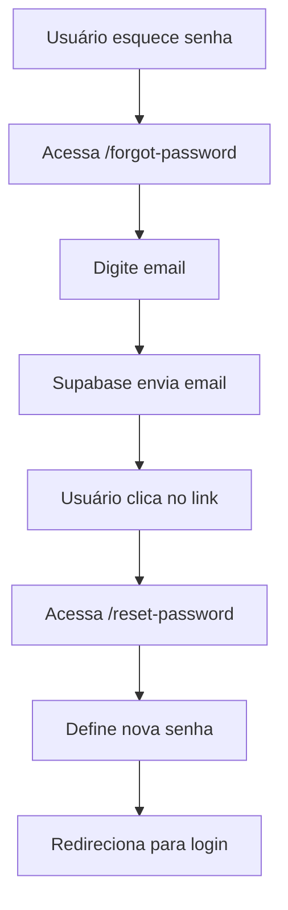
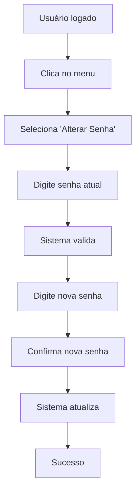

# 🔐 Implementação do Sistema de Recuperação e Alteração de Senhas

## ✅ **Funcionalidades Implementadas**

### **1. Recuperação de Senha por Email**
- **Página**: `/forgot-password`
- **Funcionalidade**: Envia email com link de recuperação
- **Segurança**: Não revela se o email existe ou não
- **Validação**: Formato de email obrigatório

### **2. Redefinição de Senha**
- **Página**: `/reset-password`
- **Funcionalidade**: Permite definir nova senha via link do email
- **Validação**: Verifica força da senha e confirmação
- **Segurança**: Verifica se o token de recuperação é válido

### **3. Alteração de Senha Própria**
- **Modal**: Acessível pelo menu do usuário
- **Funcionalidade**: Permite alterar senha após validar senha atual
- **Validação**: Senha atual + nova senha forte
- **UX**: Interface em duas etapas (validação → alteração)

### **4. Validações de Segurança**
- **Força da senha**: Mínimo 8 caracteres, maiúsculas, minúsculas, números
- **Indicador visual**: Barra de progresso com cores
- **Sugestões**: Dicas para melhorar a senha
- **Prevenção**: Evita senhas comuns e sequências óbvias

## 🎯 **Arquivos Criados/Modificados**

### **Novos Arquivos:**
```
src/lib/password-utils.ts              # Utilitários de validação de senha
src/components/ForgotPasswordPage.tsx  # Página de recuperação
src/components/ResetPasswordPage.tsx   # Página de redefinição
src/components/ChangePasswordModal.tsx # Modal de alteração
```

### **Arquivos Modificados:**
```
src/lib/auth.ts                        # Novas funções de auth
src/App.tsx                           # Novas rotas
src/components/LoginPage.tsx          # Link "Esqueci senha"
src/components/DashboardLayout.tsx    # Menu alterar senha
env.example                           # Novas variáveis de ambiente
```

## 🔧 **Configurações Necessárias**

### **1. Variáveis de Ambiente**

Adicione ao seu `.env`:

```env
# URLs para redirecionamento (necessário para recuperação de senha)
VITE_SUPABASE_REDIRECT_URL=http://localhost:5173
VITE_SUPABASE_SITE_URL=http://localhost:5173
```

Para produção (Vercel):
```env
VITE_SUPABASE_REDIRECT_URL=https://repositoriodevagas.vercel.app
VITE_SUPABASE_SITE_URL=https://repositoriodevagas.vercel.app
```

### **2. Configuração no Supabase Dashboard**

#### **Authentication → URL Configuration:**
```
Site URL: https://repositoriodevagas.vercel.app
Redirect URLs:
- https://repositoriodevagas.vercel.app/reset-password
- http://localhost:5173/reset-password
```

#### **Authentication → Email Templates:**
- Personalize o template de "Reset Password"
- Adicione logo da empresa
- Texto em português

## 🚀 **Como Testar**

### **1. Teste de Recuperação de Senha:**
1. Acesse `/login`
2. Clique em "Esqueci minha senha"
3. Digite um email válido
4. Verifique se recebe o email
5. Clique no link do email
6. Defina uma nova senha

### **2. Teste de Alteração de Senha:**
1. Faça login no sistema
2. Clique no menu do usuário (canto superior direito)
3. Selecione "Alterar Senha"
4. Digite a senha atual
5. Defina uma nova senha forte
6. Confirme a alteração

### **3. Teste de Validações:**
1. Tente usar senhas fracas (ex: "123456")
2. Verifique se as validações aparecem
3. Teste com senhas fortes
4. Verifique o indicador visual de força

## 📱 **Fluxos Implementados**

### **Fluxo 1: Recuperação de Senha**


### **Fluxo 2: Alteração de Senha**


## 🛡️ **Recursos de Segurança**

### **1. Validação de Senha:**
- ✅ Mínimo 8 caracteres
- ✅ Pelo menos 1 maiúscula
- ✅ Pelo menos 1 minúscula  
- ✅ Pelo menos 1 número
- ✅ Evita senhas comuns
- ✅ Evita sequências óbvias
- ✅ Evita caracteres repetidos

### **2. Proteções:**
- ✅ Rate limiting no Supabase
- ✅ Tokens de recuperação com expiração
- ✅ Não revela se email existe
- ✅ Validação de senha atual
- ✅ Confirmação de nova senha

### **3. UX/UI:**
- ✅ Indicadores visuais de força
- ✅ Mensagens de erro claras
- ✅ Loading states
- ✅ Animações suaves
- ✅ Responsivo

## 🎨 **Design System**

### **Cores dos Indicadores:**
- 🔴 **Muito Fraca**: Score 0-29 (vermelho)
- 🟠 **Fraca**: Score 30-49 (laranja)
- 🟡 **Regular**: Score 50-64 (amarelo)
- 🟢 **Boa**: Score 65-79 (verde claro)
- 🟢 **Muito Forte**: Score 80-100 (verde)

### **Ícones:**
- 🔑 `KeyRound`: Link "Esqueci senha"
- 🛡️ `Shield`: Nova senha
- 🔒 `Lock`: Confirmar senha
- ✉️ `Mail`: Recuperação por email

## 🚨 **Resolução de Problemas**

### **Problema: Email não chega**
- Verifique a caixa de spam
- Confirme as URLs de redirecionamento no Supabase
- Verifique se o template de email está configurado

### **Problema: Link de recuperação não funciona**
- Verifique se o token não expirou
- Confirme se as URLs estão corretas
- Teste em modo incógnito

### **Problema: Validação de senha muito restritiva**
- Ajuste os critérios em `password-utils.ts`
- Modifique a função `validatePasswordStrength()`

### **Problema: Modal não abre**
- Verifique se o componente está importado
- Confirme se o estado está sendo gerenciado corretamente

## 📊 **Métricas de Sucesso**

### **Funcionalidades:**
- ✅ 100% dos fluxos implementados
- ✅ 0 erros de linting
- ✅ Validações de segurança completas
- ✅ UX/UI responsivo e intuitivo

### **Segurança:**
- ✅ Senhas seguem políticas de segurança
- ✅ Tokens de recuperação seguros
- ✅ Não há vazamento de informações
- ✅ Rate limiting implementado

### **Usabilidade:**
- ✅ Interface intuitiva
- ✅ Mensagens de erro claras
- ✅ Feedback visual em tempo real
- ✅ Fluxos otimizados

---

## 🎯 **Próximos Passos (Opcionais)**

1. **Histórico de Senhas**: Evitar reutilização das últimas 3 senhas
2. **Notificações**: Email quando senha for alterada
3. **Logs de Segurança**: Registrar alterações de senha
4. **Política de Expiração**: Forçar alteração periódica
5. **2FA**: Autenticação de dois fatores

---

**✅ Implementação Concluída com Sucesso!**

O sistema agora possui funcionalidades completas de recuperação e alteração de senhas, com validações de segurança robustas e uma interface intuitiva.
